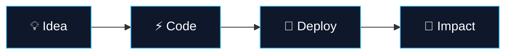

<p align="center">
  
</p>

<p align="center">
  
</p>

<p align="center">
  <a href="https://luis.novatec.ink">
    
  </a>
  <a href="https://www.novatec.ink">
    
  </a>
  <a href="https://github.com/Luiscarranza13">
    
  </a>
  <a href="mailto:hello@novatec.ink">
    
  </a>
</p>

<p align="center">
  
  
  
</p>

---

## 🧑‍💻 About Me

```bash
luis@novatec:~$ whoami

Full Stack Developer | AI Engineer | Founder of NovaTec
🚀 Building futuristic web experiences with cutting-edge technology
💡 Passionate about AI, SaaS, and premium digital products
```

<div align="center">



</div>

---

## 🚀 Tech Stack

<div align="center">

| Category | Technologies |
|:--------:|-------------|
| 🎨 **Frontend** |     |
| ⚙️ **Backend** |     |
| 🗄️ **Database** |    |
| ☁️ **Cloud** |    |
| 🤖 **AI/ML** |   |

</div>

---

## 📊 Skills & Expertise

<div align="center">
  
```text
💻 Full Stack Development     ██████████░░░░░░░░░░ 90%
🤖 AI Integration            ████████████████░░░░ 85%
☁️  Cloud Architecture       ████████████░░░░░░░░ 75%
📱 Mobile Development        ██████████████░░░░░░ 80%
🎨 UI/UX Design              █████████████████░░░░ 95%
```

</div>

---

## 🌟 Featured Projects

<div align="center">

| Project | Description | Tech Stack | Status |
|:-------:|-------------|------------|--------|
| 🚀 **[NovaTec Labs](https://novatec.ink)** | Digital innovation lab crafting futuristic web experiences | Next.js • TypeScript • TailwindCSS |  |
| 💬 **[AI Chat Platform](https://github.com/Luiscarranza13)** | Real-time AI-powered chat with streaming responses | React • FastAPI • WebSockets |  |
| 📱 **[Mobile SaaS Suite](https://github.com/Luiscarranza13)** | Cross-platform mobile apps with offline capabilities | React Native • Expo • MongoDB |  |

</div>

---

## 📈 GitHub Analytics

<div align="center">
  
  
</div>

<div align="center">
  
</div>

---

## 🤝 Connect With Me

<div align="center">
  
[](https://linkedin.com/in/luiscarranza)
[](https://twitter.com/luiscarranza)
[](https://instagram.com/luiscarranza)
[](https://discord.gg/novatec)

</div>

---

<p align="center">
  
</p>

<div align="center">
  <sub>✨ Building the future, one line of code at a time ✨</sub>
</div>
